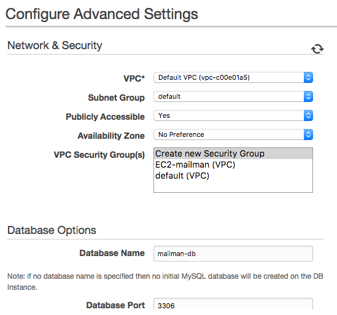
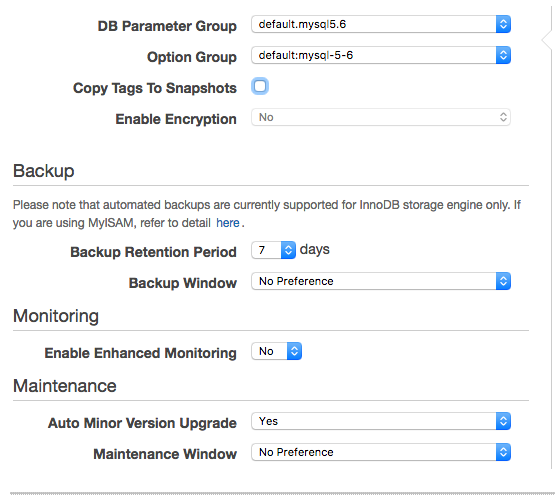

# Configure RDS
Amazon Relational Database Service (Amazon RDS) makes it easy to set up, operate, and scale relational databases in the cloud. It provides cost-efficient and resizable capacity while managing time-consuming database administration tasks, freeing you up to focus on your applications and business.

## Setting Up for RDS

Navigate to https://ap-northeast-1.console.aws.amazon.com/rds/home?region=ap-northeast-1# . 

Click **Get Started**.

###  Step 1: Select Engine

Here, we will need to choose the DB Engine we use in the following config. We choose MySQL, for instance.

Then Production - Dev/Test - MySQL for lower cost (hope).

### Step 2: Specify DB Details

Configure your database. In this example, the following settings are applied.

- Allocated Storage: 20GB
- DB Instance Identifier: mailman
- Master Username: mailman

### Step 3: Configure Advanced Settings

* Database Name should be mailmandb here. No dash is allowed.

### Step 4: Security Group

You will be unable to connect to your database instance unless you have previously authorized access on your chosen security group.

Go here: https://ap-northeast-1.console.aws.amazon.com/ec2/v2/home?region=ap-northeast-1#SecurityGroups:sort=groupName (Yes, no RDS pane but EC2). You will find an instance called **rds-launch-wizard**. 

Select it, turn to the inbound pane in the bottom, and click Edit.

Add a rule:
- Type: MYSQL / Aurora
- Source: Custom [YOUR EC2 IP]/32

Save.

### Step 5: View Endpoint Address

Open RDS Dashboard, click Instances in the left nav.

Expand the instance we just created, and you will see a Endpoint address. Log it down. For example, mailman.abcdef.ap-northeast-1.rds.amazonaws.com:3389

Now we have finished our RDS config. Turn to next page.
