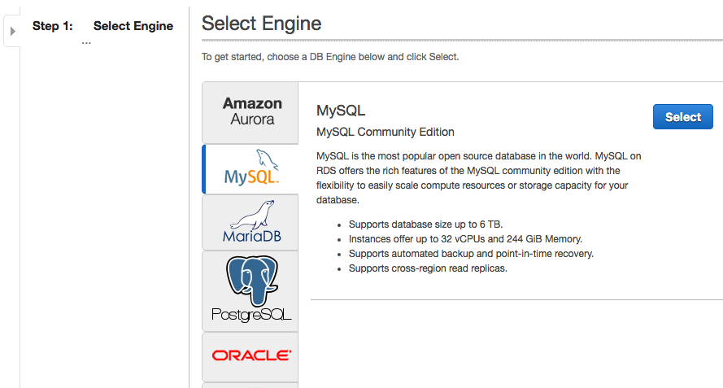

# Configure RDS
Amazon Relational Database Service (Amazon RDS) makes it easy to set up, operate, and scale relational databases in the cloud. It provides cost-efficient and resizable capacity while managing time-consuming database administration tasks, freeing you up to focus on your applications and business.

## Setting Up for RDS

Navigate to https://ap-northeast-1.console.aws.amazon.com/rds/home?region=ap-northeast-1# . 

Click **Get Started**.

###  Step 1: Select Engine

Here, we will need to choose the DB Engine we use in the following config. We choose MySQL, for instance.

Then Production - Dev/Test - MySQL for lower cost (hope).

  sudo apt-get install libmysqlclient-dev

pip install MySQL-python 
